# Contract Intelligence — Riverty RAG case study

A tool for the legal team's two recurring questions — **which contracts do *not* contain clause X?** and
**which contracts still carry a superseded company name?** — over PDFs, scans and handwritten JPEGs.

It works like a file converter: drop one or many contracts on the start page and each one is read and checked
automatically. The list underneath shows one line per contract — *„2 Klauseln fehlen · alter Firmenname auf
Seite 3“* or *„Alles in Ordnung“* — and the contract page shows the contract itself, page by page, with every
finding marked where it is: the old name boxed on the page, a dashed line where the missing clause belongs, each
with a suggested correction to accept, edit or dismiss. Accepted corrections become a corrected copy that can be
downloaded or filed in the contract storage; the original is never modified. Nothing has to be started or
configured — the only clicks are the decisions.

The pitch in one sentence: *retrieval is good at finding what is there and bad at proving what is not, so the
system decomposes every contract at ingest time into typed clauses and resolved entities, stores that structure in a
knowledge graph (Neo4j) next to the corporate guideline and the public company register, answers the absence
question there, and lets a strong model verify every finding against the passages the graph selects.*

## What is different about it

| Concern | Answer built in |
| --- | --- |
| "Why not just ask an LLM?" | Absence is a lookup, not an inference: every contract is decomposed into typed clauses at ingest, and the **corporate guideline** (`data/guidelines.json`: required clause types per contract type) says which of them must be there. The LLM refines labels and verifies; it is never the only source of truth. |
| "Why a knowledge graph?" | Because the two questions are graph questions. In Neo4j (`api/app/graph.py`) a contract *has* clauses that *are* clause types, a contract type *requires* clause types, and an old name *was renamed to* the current one — `GET /api/graph/gaps` answers „welchem Vertrag fehlt X“ as one pattern. The graph is also the RAG store (vector + full-text index per clause): the models no longer read whole contracts but the outline plus the clauses the graph ranks as relevant, the neighbours at the insertion point, and the wording the team accepted before. Database-first: the name register is seeded from **GLEIF**, the public LEI register, which records *Arvato Payment Solutions GmbH* as the previous legal name of Riverty GmbH (`docs/graph-data-sources.md`). Neo4j is the database: one graph holds the contracts, their pages, clauses and names, the guideline, the register, the decisions and the audit log (`api/app/db.py`). |
| "How confident is it?" | Every finding is a marker **on the page**, with the quoted passage; a cross-checked finding also carries the model's **reason** in plain German. Each result says whether it was cross-checked or is the rule result only — and when the cross-check could not run (quota, outage) it says so and is repeated at the next restart. |
| "Could it be wrong?" | Yes — so the **verifier reads the graph's selection and, before it confirms a missing clause, the whole contract** (never just retrieved chunks) for every missing clause the guideline requires and for every old-name mention, low-OCR pages become an explicit *nicht lesbar* instead of a silent pass, a finding whose place on the page cannot be found becomes a page-level banner rather than a wrong box, and precision/recall are measured against a known answer key (`docs/ps-coverage.md`). Every finding waits for a person until the team has agreed with that kind of finding often enough. |
| "Do we have to decide everything, every time?" | No. Decisions are stored per file (SHA-256) and come back when the same contract is checked again; the note on a dismissal becomes a precedent for the verifier; and once the team has agreed with a class of finding 8 times in a row with ≥ 95 % agreement, only a deterministic spot-check sample — 20 %, later 10 %, at least one per contract — still waits for a person. Automatic decisions are visible and can be undone; one dismissal returns the class to full review. |
| "These documents are sensitive." | The original is never modified. The corrected copy is a separate file — old name replaced in place on digital pages, highlighted with a note on scans, missing clauses on an addendum page — built on request and pushed to the contract storage only on request, under an Idempotency-Key. Contracts, text, results and decisions stay in one database, only the pages of the contract being checked go to the model, and every ingest, decision, filing and deletion lands in an **append-only audit log** keyed by document SHA-256. |
| "Is it safe against manipulated documents?" | Contract text is **untrusted input**: hidden instructions are screened at ingest, the contract page warns, and every model prompt is told to treat document text as data. Fixture C13 carries a hidden injection. |
| "What about scans and handwriting?" | Per-page routing: text layer → direct; no text layer → Tesseract with a confidence gate; low confidence → **vision model**; OCR noise → **fuzzy entity matching**. The markers follow the same route: the PDF text layer places them exactly, Tesseract word boxes place them on scans, the vision model on handwriting. |
| "Which model, and why?" | **Routing by task**: cheap low-thinking Flash for labelling, drafting and locating, high-thinking Pro only for handwriting and verification, Flash-Lite for screening. Offline, the deterministic core still runs end to end. *So funktioniert es* lists the models in use. |

## The front-end is for lawyers, not engineers

German by default, English one click away (DE | EN in the top bar; the choice is also sent to the models, so the
verifier's reasons and the drafted clauses come back in that language). Three steps — *1 Hochladen · 2 Prüfen ·
3 Herunterladen* — shown on every page, and nothing else:

* **Verträge prüfen** (`/`) — the drop zone (PDF, JPG, PNG; one or many), the link *Beispielverträge laden* (next to
  it *Neue Dateien aus SharePoint holen* when `DOCUMENT_SOURCE=sharepoint`), and the list of contracts with one
  result line each: *Wird gelesen …* → *Wird geprüft …* → *„2 Klauseln fehlen · alter Firmenname auf Seite 3“* or
  *Alles in Ordnung*. A filter row over the list asks the problem statement's question across all contracts in one
  click: *Alle | Alter Firmenname | Klausel fehlt* [one of the 12 clause types] *| Regelung fehlt* [any wording →
  *Suchen*]. *Klausel fehlt* reads each contract's result (a row the guideline does not require is marked *„laut
  Richtlinie nicht erforderlich“*); *Regelung fehlt* runs the free-text passage audit (`POST /api/audits`, hybrid
  retrieval plus the verifier) and keeps only the contracts without that provision — *„Regelung nicht gefunden“*,
  *„nur teilweise vorhanden“* or *„nicht gefunden (ohne KI-Gegenprüfung)“* — under the line *„n von m Verträgen ohne
  diese Regelung“*.
* **Prüfen** (`/contracts/:id`) — the contract itself, every page rendered, with the findings marked on it:
  an old company name as a box around the words, a missing clause as a dashed line where it belongs („Hier fehlt:
  Haftungsbegrenzung“), a partly present clause as a box around the passage. The panel beside the pages shows **one
  finding at a time** — „Fundstelle 2 von 5“, quote, the cross-check's reason, the suggestion (the new name from the
  register, or a clause drafted in the contract's language — editable on digital PDFs) and two buttons,
  **Übernehmen** or **Nicht zutreffend** (with an optional note); a decision moves on to the next open finding,
  clicking a marker jumps to it, arrows go back and forth. Under the panel: **Weiter zum Download**, and folded away
  *Weitere Angaben* (clauses present, cross-check status), *Erneut prüfen*, *Löschen*.
* **Herunterladen** (`/contracts/:id/download`) — „Ihre korrigierte Fassung ist fertig“: what was applied („2
  Firmennamen ersetzt · 1 Klausel ergänzt (Nachtrag) · 1 noch offen“), the big **Korrigierte Fassung herunterladen**,
  **In der Vertragsablage ablegen**, a preview of the corrected PDF, and the link to the next contract with open
  findings. The original is never changed.
* **So funktioniert es** (`/how-it-works`) — generated from `GET /api/pipeline`: the 14 stages in three phases (Lesen ·
  Prüfen · Entscheiden) as numbered cards, one plain sentence each plus the tools and model used and what the stage
  produces, and a worked example computed from a real contract (pages by method, clauses and names found, findings
  placed, suggestions, decisions, corrected copy). It cannot drift from the code because it renders the API's list.

* **Technik** (`/technik`) — the one page for engineers: the same 14 stages with module, model and thinking level,
  rules and thresholds; the graph model with live node and relationship counts and the guideline-gap Cypher; and a
  trace of one real contract through every stage (pages by method, every clause with rule and model label, every
  name mention, the cross-check result, every finding with anchor, review rule and decision).

No percentages, method traces or model settings in the lawyer's way. The page contract is in `docs/ui-spec.md`;
the numbers behind the design — contract volumes, manual vs. tool time, model cost, why a person still decides — are
in `docs/cost-benefit.md`.

## Architecture

```mermaid
flowchart LR
  UP[Upload / Beispielverträge] --> L[Loader: per-page routing]
  L -->|text layer| T[Text]
  L -->|no text layer| O[Tesseract]
  O -->|conf < 80%| V[Gemini Pro vision]
  T & O & V --> S[Segment into clauses]
  S --> C[Classify: rules + Flash]
  S --> E[Entities: registry + fuzzy + Flash]
  S --> M[Embed]
  C & E & M --> KG[(Neo4j, the database: Contract · Page · Clause · ClauseType · ContractType · Entity · Decision · Finding · AuditLog; vector + full-text index)]
  G[Corporate guideline] -->|REQUIRES| KG
  GL[GLEIF LEI register] -->|RENAMED_TO| KG
  KG --> R[Report graph, LangGraph: rules → cross_check — the verifier reads the outline + the clauses the graph selects, then the whole contract before confirming an absence]
  R --> P[place: text layer · OCR word boxes · vision]
  P --> D[draft: the register's successor name · a clause by Flash from neighbours + accepted precedents]
  D --> POL[policy: carry-over · spot check · summarize]
  POL --> UI[Prüfen: markers · one finding at a time → Herunterladen: corrected copy]
  UI -->|Übernehmen / Nicht zutreffend| DEC[(decisions: carry-over · precedents · review rate)]
  DEC --> R
  DEC --> KG
  UI -->|corrected copy| ST[Contract storage REST API]
```



* `api/app/db.py` — Neo4j is the database: a `Store` is one unit of work (`add` · `get` · `delete` · `commit` in one
  transaction) over the dataclasses in `api/app/models.py` — contracts, pages, clauses, name mentions, audits, findings,
  decisions, the audit log, the stored copies, the sync state — with integer ids from Counter nodes
* `api/app/graph.py` — the knowledge side of the same graph: seed (taxonomy, guideline as `REQUIRES` edges, name register
  from the built-in list and GLEIF with `RENAMED_TO`), hybrid retrieval (vector `SEARCH` + full-text index), the
  guideline gap pattern, and what the models get to read (`context`, `draft_context`)
* `api/app/ingest/` — loader, OCR, segmentation, classification, entities (registry extended from the graph), embeddings,
  injection screen, pipeline (one commit per contract: pages, clauses, mentions)
* `api/app/report.py` — the automatic per-contract result as a LangGraph `StateGraph` with the nodes `rules →
  cross_check → place → draft → policy → summarize` (rules first, then the verifier, then the findings placed on the
  page with suggestions and decision state; a re-check re-enters at `place`); `api/app/audits/verify.py` — the
  verifier, with the scoped-then-full read (`verify_absence`)
* `api/app/pipeline.py` — the single description of all 14 stages (read · check · decide) with tools, model task and
  what each produces, served by `GET /api/pipeline` and rendered by *So funktioniert es*
* `api/app/locate.py` — where a passage sits on a page (text layer / Tesseract word boxes / vision); `api/app/draft.py` —
  the drafted clause; `api/app/files.py` — the page images for the viewer
* `api/app/learning.py` — what the team's decisions do (carry-over, precedents, falling review rate under the rules in
  `api/app/policy.py`); `api/app/correct.py` — the corrected copy
* `api/app/llm.py` — the model routing table; `api/app/routers.py` — REST API; `api/app/main.py` — startup catch-up
  (unfinished, degraded and old-format results are rebuilt or upgraded)
* `web/` — React 19 + TypeScript + MUI 9, four pages (`src/pages/Home.tsx`, `Contract.tsx` = Prüfen, `Download.tsx` =
  Herunterladen, `HowItWorks.tsx`) with the three-step strip (`components/ui.tsx`), German/English (`src/vocab.ts`,
  `src/i18n.tsx`); `web/e2e/smoke.spec.ts` — Playwright browser tests
* `data/generate.py` — builds the corpus: every input type, with known ground truth; `data/guidelines.json` — the corporate guideline
* `docs/deck/build.py` — the presentation: `python3 docs/deck/build.py` writes `docs/presentation.html` (15 slides, arrow keys,
  `?print` for a PDF) and one design-canvas artboard per slide; `docs/deck/build_pptx.py` writes the same slides as an editable
  `docs/contract-intelligence.pptx` (native shapes); `docs/architecture-decisions.md` and `docs/cost-benefit.md`
  carry the why and the numbers behind it
* `infra/terraform/` — production shape on Azure (documentation, not applied)

Per contract the API offers `GET /api/documents/{id}` (the result), `GET …/pages/{n}.png`, `GET …/file` (the
original), `POST …/items/{key}/decide`, `GET …/corrected.pdf`, `POST …/file-to-storage`, `POST …/report` (check
again) and `DELETE …`; `GET /api/pipeline` returns the stage list the *So funktioniert es* page renders. The graph:
`GET /api/graph/stats` (nodes, relationships, gaps), `GET /api/graph/gaps` (the guideline question as one Cypher
pattern), `POST /api/graph/gleif` (refresh the name
register from the LEI API). The Neo4j browser on http://localhost:7474 shows the graph itself.

### Also in the API

The earlier, broader workflow still exists behind `http://localhost:8000/docs` and is covered by the tests. The start
page uses two pieces of it — the *Regelung fehlt* filter runs the free-text passage audit (`POST /api/audits`, kind
`missing_passage`) and the SharePoint link calls the sync (`POST /api/documents/sync`, `api/app/sources.py`). The rest
is **API-only, not part of the legal-team UI**: the other cross-contract audits (`POST /api/audits/guideline`,
`GET /api/coverage`, `api/app/audits/graph.py`) with their own review queue (`POST /api/findings/{id}/review`,
`…/push-to-storage`) and policy view (`GET /api/policy`); cited question answering over the corpus (`POST /api/chat`,
`api/app/retrieval.py`, `chat.py`); and the ground-truth evaluation (`POST /api/eval/run`, `api/app/evaluation.py`).
The review rules in `api/app/policy.py` are the same ones the viewer's decisions follow.

## Sample corpus (generated, ground truth known)

14 contracts: born-digital PDFs in English and German, a clean scan and a low-quality skewed scan, a handwritten
1996 agreement (JPEG), a photographed typed amendment (JPEG), a digital contract whose **scanned signature page**
still names the old entity, one that already says "Riverty (formerly Arvato Payment Solutions)", one with the
unrelated **Arvato Systems** as counterparty, and one with a hidden prompt-injection.

## Run it

```bash
cp .env.example .env            # add GEMINI_API_KEY for the full pipeline; leave empty for offline mode
docker compose up --build       # web on http://localhost:5173, api on http://localhost:8000/docs, Neo4j browser on :7474
```

Open http://localhost:5173, drop a contract or click *Beispielverträge laden*. Each contract shows *Wird gelesen …*,
then *Wird geprüft …*, then its result; click it to see the pages with every finding marked. Click a marker, accept
or dismiss the suggestion, then download the corrected copy or file it. `POST /api/documents/ingest-samples?batch=2`
adds four "new arrivals"; batches 3 and 4 are the real contracts from `docs/ps-coverage.md`. Switch to EN in the
top bar at any time.

Local development:

```bash
docker compose up -d neo4j                          # NEO4J_URI / NEO4J_PASSWORD in .env (see .env.example)
cd api && uv run uvicorn app.main:app --reload      # http://localhost:8000
cd web && npm install && npm run dev               # http://localhost:5173 (proxies /api)
```

## Tests

```bash
cd api && uv run pytest tests/test_ingest_units.py tests/test_policy_units.py tests/test_providers_units.py tests/test_resilience_units.py tests/test_report_units.py tests/test_learning_units.py tests/test_correct_units.py -q   # 56 offline unit tests in 7 files, incl. the report graph
cd api && uv run pytest            # the above plus 10 live Gemini tests (skipped without a key); the 12 end-to-end tests need a scratch Neo4j they can wipe: docker compose --profile test up -d neo4j-test && NEO4J_TEST_URI=bolt://localhost:7688 uv run pytest tests/test_end_to_end_graph.py
cd web && npx playwright test      # the browser tests in web/e2e/smoke.spec.ts against the running stack (BASE_URL overrides :5173)
```

Regenerate the corpus with `cd api && uv run python ../data/generate.py`.
