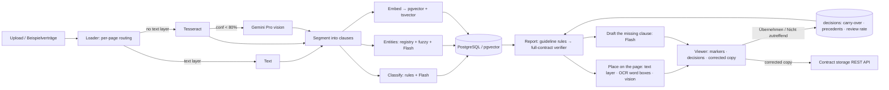

# Contract Intelligence — Riverty RAG case study

A tool for the legal team's two recurring questions — **which contracts do *not* contain clause X?** and
**which contracts still carry a superseded company name?** — over PDFs, scans and handwritten JPEGs.

It works like a file converter: drop one or many contracts on the start page and each one is read and checked
automatically. The list underneath shows one line per contract — *„2 Klauseln fehlen · alter Firmenname auf
Seite 3“* or *„Alles in Ordnung“* — and the contract page shows the contract itself, page by page, with every
finding marked where it is: the old name boxed on the page, a dashed line where the missing clause belongs, each
with a suggested correction to accept, edit or dismiss. Accepted corrections become a corrected copy that can be
downloaded or filed in the contract storage; the original is never modified. Nothing has to be started or
configured — the only clicks are the decisions.

The pitch in one sentence: *retrieval is good at finding what is there and bad at proving what is not, so the
system decomposes every contract at ingest time into typed clauses and resolved entities, checks that structure
against the corporate guideline, and lets a strong model verify every finding against the full contract.*

## What is different about it

| Concern | Answer built in |
| --- | --- |
| "Why not just ask an LLM?" | Absence is a lookup, not an inference: every contract is decomposed into typed clauses at ingest, and the **corporate guideline** (`data/guidelines.json`: required clause types per contract type) says which of them must be there. The LLM refines labels and verifies; it is never the only source of truth. |
| "How confident is it?" | Every finding is a marker **on the page**, with the quoted passage; a cross-checked finding also carries the model's **reason** in plain German. Each result says whether it was cross-checked or is the rule result only — and when the cross-check could not run (quota, outage) it says so and is repeated at the next restart. |
| "Could it be wrong?" | Yes — so the **verifier reads the whole contract** (not retrieved chunks) for every missing clause the guideline requires and for every old-name mention, low-OCR pages become an explicit *nicht lesbar* instead of a silent pass, a finding whose place on the page cannot be found becomes a page-level banner rather than a wrong box, and precision/recall are measured against a known answer key (`docs/ps-coverage.md`). Every finding waits for a person until the team has agreed with that kind of finding often enough. |
| "Do we have to decide everything, every time?" | No. Decisions are stored per file (SHA-256) and come back when the same contract is checked again; the note on a dismissal becomes a precedent for the verifier; and once the team has agreed with a class of finding 8 times in a row with ≥ 95 % agreement, only a deterministic spot-check sample — 20 %, later 10 %, at least one per contract — still waits for a person. Automatic decisions are visible and can be undone; one dismissal returns the class to full review. |
| "These documents are sensitive." | The original is never modified. The corrected copy is a separate file — old name replaced in place on digital pages, highlighted with a note on scans, missing clauses on an addendum page — built on request and pushed to the contract storage only on request, under an Idempotency-Key. Contracts, text, results and decisions stay in one database, only the pages of the contract being checked go to the model, and every ingest, decision, filing and deletion lands in an **append-only audit log** keyed by document SHA-256. |
| "Is it safe against manipulated documents?" | Contract text is **untrusted input**: hidden instructions are screened at ingest, the contract page warns, and every model prompt is told to treat document text as data. Fixture C13 carries a hidden injection. |
| "What about scans and handwriting?" | Per-page routing: text layer → direct; no text layer → Tesseract with a confidence gate; low confidence → **vision model**; OCR noise → **fuzzy entity matching**. The markers follow the same route: the PDF text layer places them exactly, Tesseract word boxes place them on scans, the vision model on handwriting. |
| "Which model, and why?" | **Routing by task**: cheap low-thinking Flash for labelling, drafting and locating, high-thinking Pro only for handwriting and verification, Flash-Lite for screening. Offline, the deterministic core still runs end to end. *So funktioniert es* lists the models in use. |

## The front-end is for lawyers, not engineers

German by default, English one click away (DE | EN in the top bar; the choice is also sent to the models, so the
verifier's reasons and the drafted clauses come back in that language). Three pages, nothing else:

* **Verträge prüfen** (`/`) — the drop zone (PDF, JPG, PNG; one or many), the link *Beispielverträge laden*, and the
  list of contracts with one result line each: *Wird gelesen …* → *Wird geprüft …* → *„2 Klauseln fehlen · alter
  Firmenname auf Seite 3“* or *Alles in Ordnung*.
* **Contract page** (`/contracts/:id`) — the contract itself, every page rendered, with the findings marked on it:
  an old company name as a box around the words, a missing clause as a dashed line where it belongs („Hier fehlt:
  Haftungsbegrenzung“), a partly present clause as a box around the passage. Clicking a marker opens the finding:
  quote, the cross-check's reason, the suggestion (the new name, or a clause drafted in the contract's language —
  editable on digital PDFs) and the decision, **Übernehmen** or **Nicht zutreffend** (with an optional note). A
  sidebar lists the findings in page order and the clauses present, and holds *Korrigierte Fassung herunterladen*,
  *In der Vertragsablage ablegen*, *Erneut prüfen* and *Löschen*.
* **So funktioniert es** (`/how-it-works`) — the four steps in plain words and the models used.

No percentages, method traces or model settings in the way. The page contract is in `docs/ui-spec.md`.

## Architecture



* `api/app/ingest/` — loader, OCR, segmentation, classification, entities, embeddings, injection screen, pipeline
* `api/app/report.py` — the automatic per-contract result (rules first, then the verifier, then the findings placed on
  the page with suggestions and decision state); `api/app/audits/verify.py` — the full-contract verifier
* `api/app/locate.py` — where a passage sits on a page (text layer / Tesseract word boxes / vision); `api/app/draft.py` —
  the drafted clause; `api/app/files.py` — the page images for the viewer
* `api/app/learning.py` — what the team's decisions do (carry-over, precedents, falling review rate under the rules in
  `api/app/policy.py`); `api/app/correct.py` — the corrected copy
* `api/app/llm.py` — the model routing table; `api/app/routers.py` — REST API; `api/app/main.py` — startup catch-up
  (unfinished, degraded and old-format results are rebuilt or upgraded)
* `web/` — React 19 + TypeScript + MUI 9, three pages (`src/pages/Home.tsx`, `Contract.tsx`, `HowItWorks.tsx`),
  German/English (`src/vocab.ts`, `src/i18n.tsx`); `web/e2e/smoke.spec.ts` — Playwright browser tests
* `data/generate.py` — builds the corpus: every input type, with known ground truth; `data/guidelines.json` — the corporate guideline
* `infra/terraform/` — production shape on Azure (documentation, not applied)

Per contract the API offers `GET /api/documents/{id}` (the result), `GET …/pages/{n}.png`, `GET …/file` (the
original), `POST …/items/{key}/decide`, `GET …/corrected.pdf`, `POST …/file-to-storage`, `POST …/report` (check
again) and `DELETE …`.

### Also in the API

The earlier, broader workflow still exists behind `http://localhost:8000/docs` and is covered by the tests, but is
**API-only, not part of the legal-team UI**: cross-contract audits (`POST /api/audits`, `POST /api/audits/guideline`,
`GET /api/coverage`, `api/app/audits/graph.py`) including free-text passage checks, with their own review queue
(`POST /api/findings/{id}/review`, `…/push-to-storage`) and policy view (`GET /api/policy`); cited question answering
over the corpus (`POST /api/chat`, `api/app/retrieval.py`, `chat.py`); the ground-truth evaluation
(`POST /api/eval/run`, `api/app/evaluation.py`); and the SharePoint / local-folder sync (`POST /api/documents/sync`,
`api/app/sources.py`). The review rules in `api/app/policy.py` are the same ones the viewer's decisions follow.

## Sample corpus (generated, ground truth known)

14 contracts: born-digital PDFs in English and German, a clean scan and a low-quality skewed scan, a handwritten
1996 agreement (JPEG), a photographed typed amendment (JPEG), a digital contract whose **scanned signature page**
still names the old entity, one that already says "Riverty (formerly Arvato Payment Solutions)", one with the
unrelated **Arvato Systems** as counterparty, and one with a hidden prompt-injection.

## Run it

```bash
cp .env.example .env            # add GEMINI_API_KEY for the full pipeline; leave empty for offline mode
docker compose up --build       # web on http://localhost:5173, api on http://localhost:8000/docs
```

Open http://localhost:5173, drop a contract or click *Beispielverträge laden*. Each contract shows *Wird gelesen …*,
then *Wird geprüft …*, then its result; click it to see the pages with every finding marked. Click a marker, accept
or dismiss the suggestion, then download the corrected copy or file it. `POST /api/documents/ingest-samples?batch=2`
adds four "new arrivals"; batches 3 and 4 are the real contracts from `docs/ps-coverage.md`. Switch to EN in the
top bar at any time.

Local development:

```bash
docker compose up -d db
cd api && uv run uvicorn app.main:app --reload      # http://localhost:8000
cd web && npm install && npm run dev               # http://localhost:5173 (proxies /api)
```

## Tests

```bash
cd api && uv run pytest tests/test_ingest_units.py tests/test_policy_units.py tests/test_providers_units.py tests/test_resilience_units.py tests/test_report_units.py tests/test_learning_units.py tests/test_correct_units.py -q   # 56 offline unit tests
cd api && uv run pytest            # the above plus test_report_units.py, test_learning_units.py and test_correct_units.py (placed findings, decisions, corrected copy), 12 end-to-end tests against pgvector (test_end_to_end_db.py drops and recreates the schema of DATABASE_URL) and 10 live Gemini tests (skipped without a key)
cd web && npx playwright test      # 7 browser tests in web/e2e/smoke.spec.ts against the running stack (BASE_URL overrides :5173)
```

Regenerate the corpus with `cd api && uv run python ../data/generate.py`.
