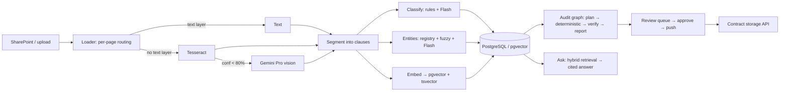

# Contract Intelligence — Riverty RAG case study

A tool for the legal team's two recurring questions — **which contracts do *not* contain passage X?** and
**which contracts still carry a superseded company name?** — over PDFs, scans and handwritten JPEGs.

The pitch in one sentence: *retrieval is good at finding what is there and bad at proving what is not, so the
system decomposes every contract at ingest time into typed clauses and resolved entities, answers absence
questions from that structure, lets a strong model verify every finding against the full contract, and never
acts without a person.*

## What is different about it

| Concern | Answer built in |
| --- | --- |
| "Why not just ask an LLM?" | Absence is a lookup in the **clause-coverage matrix**, not an inference. The LLM refines labels and verifies; it is never the only source of truth. |
| "How confident is it?" | Every finding carries a confidence, the **evidence quote with page**, and the **method trace** (rule → embedding → verifier) that produced it. |
| "Could it be wrong?" | Yes — so the **verifier reads the whole contract** (not retrieved chunks) for every non-certain claim, low-OCR pages become an explicit `unreadable` verdict instead of a silent pass, and a **ground-truth eval** puts precision/recall on screen per layer. |
| "These documents are sensitive." | Nothing changes state without **human approval**; pushes to the contract storage are **idempotent**; every action lands in an **append-only audit log** keyed by document SHA-256. |
| "Is it safe against manipulated documents?" | Contract text is **untrusted input**: hidden instructions are screened at ingest and every model prompt is told to treat document text as data. Fixture C13 carries a hidden injection. |
| "What about scans and handwriting?" | Per-page routing: text layer → direct; no text layer → Tesseract with a confidence gate; low confidence → **vision model**; OCR noise → **fuzzy entity matching** with the match ratio recorded. |
| "Which model, and why?" | **Routing by task**: cheap low-thinking Flash for labelling, high-thinking Pro only for handwriting and verification, Flash-Lite for screening. Offline, the deterministic core still runs end to end. |

## The front-end is for lawyers, not engineers

German by default, English one click away (DE | EN in the app bar; the choice is also sent to the models, so the
verifier's reasoning and answers come back in that language). The start page asks the three questions directly:
*Welchen Verträgen fehlt eine Klausel? · Welche Verträge enthalten eine bestimmte Regelung nicht? · Wo steht noch ein
alter Firmenname?* Verdicts name their author — **KI-bestätigt / Nicht gegengeprüft / Entkräftet / Nicht lesbar** —
so a machine verdict can never be mistaken for human sign-off; the check icon is reserved for people. Confidence is a
word, evidence is a quote with a page, and every finding has a collapsed *„So kam der Fund zustande“*. Percentages,
method traces, model IDs, OCR methods and checksums stay available behind the switch **Technische Details anzeigen**
(off by default) and the low-key *Technik* group in the navigation. The full page contract is in `docs/ui-spec.md`.

## Architecture



* `api/app/ingest/` — loader, OCR, segmentation, classification, entities, embeddings, injection screen, pipeline
* `api/app/audits/graph.py` — the LangGraph audit; `verify.py` — the full-contract verifier
* `api/app/retrieval.py` — pgvector + full-text (English + German stemming) fused with RRF
* `api/app/chat.py` — retrieve → cited answer graph; `evaluation.py` — scoring against `data/ground_truth.json`
* `api/app/llm.py` — the model routing table; `api/app/routers.py` — REST API incl. the mock contract storage
* `web/` — React 19 + TypeScript + MUI 9, German/English (`src/vocab.ts`, `src/i18n.tsx`); `web/e2e/` — Playwright smoke suite
* `data/generate.py` — builds the corpus: every input type, with known ground truth
* `infra/terraform/` — production shape on Azure (documentation, not applied)

## Sample corpus (generated, ground truth known)

14 contracts: born-digital PDFs in English and German, a clean scan and a low-quality skewed scan, a handwritten
1996 agreement (JPEG), a photographed typed amendment (JPEG), a digital contract whose **scanned signature page**
still names the old entity, one that already says "Riverty (formerly Arvato Payment Solutions)", one with the
unrelated **Arvato Systems** as counterparty, and one with a hidden prompt-injection.

## Run it

```bash
cp .env.example .env            # add GEMINI_API_KEY for the full pipeline; leave empty for offline mode
docker compose up --build       # web on http://localhost:5173, api on http://localhost:8000/docs
```

Then *Verträge → Beispielverträge laden*, ask one of the three questions on *Start*, decide under *Freigabe*, and see the numbers under *Technik → Qualitätsmessung*. Switch to EN in the app bar at any time.

Local development:

```bash
docker compose up -d db
cd api && uv run uvicorn app.main:app --reload      # http://localhost:8000
cd web && npm install && npm run dev               # http://localhost:5173 (proxies /api)
```

## Tests

```bash
cd api && uv run pytest            # 22 offline unit tests + 8 end-to-end against pgvector (skips without db)
cd web && npx playwright test      # 9 browser smoke tests against the running stack (BASE_URL overrides :5173)
```

Regenerate the corpus with `cd api && uv run python ../data/generate.py`.
